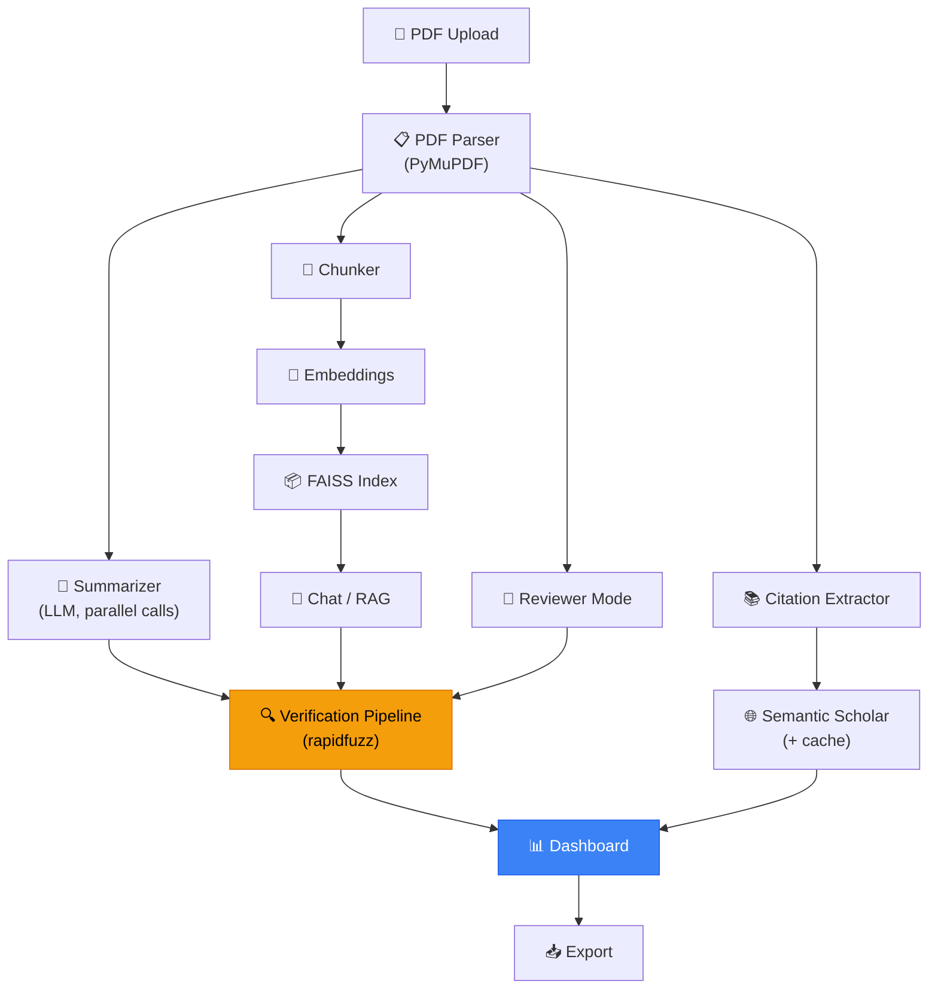

<div align="center">

# 📄 PaperLens
### Evidence-Grounded Research Tutor

**Every AI-generated insight comes with proof — and the proof is checked, not just claimed.**

[](https://www.python.org/)
[](https://streamlit.io/)
[](#license)
[](#)

</div>

---

## 🧠 What is PaperLens?

PaperLens transforms dense academic research papers into interactive learning experiences.

Instead of just summarizing PDFs, PaperLens explains research while **proving every explanation using evidence directly from the uploaded paper** — and unlike most AI summarizers, it **programmatically verifies** that proof instead of trusting the LLM to cite honestly.

Most AI paper-summarizers suffer from one core problem: *they summarize well, but you can't verify whether the information actually exists in the paper.* LLM-generated citations and quotes are frequently hallucinated — even when the model is explicitly told to cite its source.

PaperLens fixes this with an **Evidence Verification Pipeline**: every claim, quote, and page reference an LLM produces is checked with fuzzy-matching against the actual extracted PDF text before it's ever shown to the user.

---

## ✨ Core Features

| Feature | Description |
|---|---|
| 📤 **PDF Upload & Parsing** | Upload any research paper; text, sections, and page numbers are extracted with PyMuPDF |
| 📋 **Structured Summary** | Auto-generated Contributions, Methodology, Results, Limitations, and Prerequisites |
| ✅ **Evidence Verification Pipeline** | Every claim is fuzzy-matched against the real page text and badged ✅ Verified / ⚠️ Paraphrased / ❌ Unsupported — *the core differentiator* |
| 💬 **Grounded Chat** | Ask questions and get answers sourced only from the uploaded paper, with page citations and confidence scores |
| 📖 **Synced PDF Viewer** | Click any claim or answer and jump straight to the highlighted supporting text in the PDF |
| 🔗 **Citation Explorer** | Extracted references enriched with Semantic Scholar metadata and "why was this cited?" explanations |
| 🌳 **Research Family Tree** | Visual graph of the paper's intellectual lineage *(stretch goal)* |
| 🧑‍⚖️ **Reviewer Mode** | Academic-reviewer-style analysis: strengths, weaknesses, missing baselines, reproducibility score *(stretch goal)* |
| ⚠️ **Consistency Checker** | Flags contradictions between a paper's claims (e.g. Abstract) and its actual Results *(stretch goal)* |
| 📥 **Verified Summary Export** | One-click export of the summary with verification badges intact *(stretch goal)* |

---

## 🎯 Why "Grounded" Actually Means Something Here

Most tools ask an LLM to "please include page numbers and quotes" and hope for the best. PaperLens treats that as a claim to be checked, not a fact to be trusted:

```
LLM generates → claim + candidate quote + claimed page
        ↓
Backend fuzzy-matches the quote against the ACTUAL text on that page
        ↓
   ≥ 90% match  → ✅ Verified
  60–90% match  → ⚠️ Paraphrased
   < 60% match  → ❌ Unsupported (re-attempted once, then clearly labeled)
        ↓
Badge + match score shown next to every claim, chat answer, and reviewer statement
```

If the paper doesn't support an answer, PaperLens says so — it never quietly fills the gap with the model's training knowledge.

---

## 🏗️ Architecture



---

## 🛠️ Tech Stack

| Layer | Technology |
|---|---|
| **Frontend** | Streamlit + `streamlit-pdf-viewer` (synced PDF navigation & highlighting) |
| **Backend** | Python |
| **PDF Parsing** | PyMuPDF (`fitz`) |
| **LLM** | GPT-4o / GPT-4.1 (or NVIDIA NIM-hosted OpenAI-compatible models) |
| **Embeddings** | `text-embedding-3-small` |
| **Vector Store** | FAISS (`IndexFlatIP`, cosine similarity via normalized vectors) |
| **Evidence Verification** | `rapidfuzz` (fuzzy string matching + alignment) |
| **Citation Metadata** | Semantic Scholar API (with local JSON cache fallback) |
| **Visualization** | Plotly / PyVis / NetworkX |

---

## 📂 Project Structure

```
paperlens/
├── app.py                      # Streamlit entry point & orchestration
├── config.py                   # Models, thresholds, chunk sizes, API config
│
├── parser/                     # Member 1 — Document Intelligence
│   ├── pdf_parser.py
│   └── chunker.py
│
├── ai/                         # Member 2 — AI Summarization
│   ├── summarizer.py
│   └── prompts.py
│
├── rag/                        # Member 3 — Grounded Chat
│   ├── embeddings.py
│   ├── retriever.py
│   ├── prompts.py
│   └── chat.py
│
├── verification/                # Shared — Evidence Verification Pipeline
│   ├── fuzzy_match.py
│   └── verifier.py
│
├── citations/                  # Member 4 — Citation Intelligence
│   ├── extractor.py
│   ├── semantic.py
│   └── cache.py
│
├── reviewer/                   # Reviewer Mode (stretch)
│   ├── reviewer.py
│   └── consistency.py
│
├── ui/                         # Member 5 — Dashboard & UX
│   ├── dashboard.py
│   └── export.py
│
├── utils/
│   └── models.py                # Shared dataclasses / schemas
│
└── tests/
    ├── test_verifier.py
    ├── test_retriever.py
    └── test_chat.py
```

---

## 🚀 Getting Started

### Prerequisites
- Python 3.10+
- An OpenAI API key (or an NVIDIA NIM / other OpenAI-compatible key — see `config.py`)
- *(Optional)* A Semantic Scholar API key for higher-rate citation lookups

### Installation

```bash
# Clone the repository
git clone https://github.com/<your-org>/paperlens.git
cd paperlens

# Create and activate a virtual environment
python -m venv venv
source venv/bin/activate      # Windows: venv\Scripts\activate

# Install dependencies
pip install -r requirements.txt
```

### Configuration

Copy the example environment file and add your keys:

```bash
cp .env.example .env
```

```env
OPENAI_API_KEY=your_key_here
SEMANTIC_SCHOLAR_API_KEY=optional_key_here
```

### Run the app

```bash
streamlit run app.py
```

Then open the local URL Streamlit prints (typically `http://localhost:8501`).

---

## 🧪 Running Tests

```bash
python -m pytest tests/ -v
```

The Evidence Verification Pipeline (`verification/`) is the most critical component and has dedicated coverage for exact matches, paraphrases, fabricated quotes, and page-adjacency handling.

---

## 🧭 Usage Walkthrough

1. **Upload** a research paper (PDF).
2. Review the **Structured Summary** — every claim carries a ✅/⚠️/❌ verification badge.
3. **Click any claim** to jump the PDF viewer straight to the highlighted supporting text.
4. Use **Chat** to ask questions about the paper — answers are grounded and verified, with an honest "not enough evidence" response when the paper doesn't cover something.
5. Browse the **Citation Explorer** to understand the paper's references and why each was cited.
6. Open **Reviewer Mode** for a reproducibility score and any flagged consistency issues.
7. **Export** a Verified Summary Card to keep or share.

---

## 👥 Team & Ownership

| Member | Owns | Key Deliverable |
|---|---|---|
| **Member 1** | Document Processing | `process_pdf()` — parsing, chunking, section detection |
| **Member 2** | AI Briefing | `generate_brief()` — structured, evidence-linked summary |
| **Member 3** | Research Tutor | `ask_question()` — RAG + grounded, verified chat |
| **Member 4** | Citation Intelligence | `analyze_references()` — citation metadata & family tree |
| **Member 5** | Dashboard & UX | `render_dashboard()` — full UI, PDF viewer, integration |

The **Evidence Verification Pipeline** (`verify_claim()`) is a shared core module consumed by Summarization, Chat, and Reviewer Mode alike — it is the product's single most important piece of engineering, and is treated as never-cut scope even under hackathon time pressure.

---

## 🗺️ MVP Roadmap

| Stage | Adds | Outcome |
|---|---|---|
| **MVP 1 (40%)** | Upload + Summary | Demo Ready |
| **MVP 2 (60%)** | Evidence Grounding + Verification badges | Strong Submission |
| **MVP 3 (80%)** | Verified Chat + PDF highlight + Citation Explorer | Competitive Submission |
| **MVP 4 (100%)** | Reviewer Mode + Consistency Checker + Family Tree + Export | Ideal Final Product |

**Cut order under time pressure:** Family Tree → Verified Summary Export → Consistency Checker → Reviewer Mode. The Verification Pipeline is never cut — it's the entire differentiation.

---

## ⚠️ Known Limitations

- Citation metadata depends on the Semantic Scholar API; a local cache fallback is used to keep the demo resilient to rate limits or outages.
- Fuzzy-match verification is a heuristic, not a proof system — it catches hallucinated or mismatched quotes but is tuned via configurable thresholds rather than being infallible.
- Reviewer Mode, Consistency Checker, Family Tree, and Export are stretch goals and may be partially implemented depending on time constraints.

---

## 📜 License

This project was built for a hackathon. License terms: MIT (update as appropriate for your submission).

---

<div align="center">

**PaperLens doesn't just summarize research — it teaches it with evidence that's actually verified, not just claimed.**

</div>
