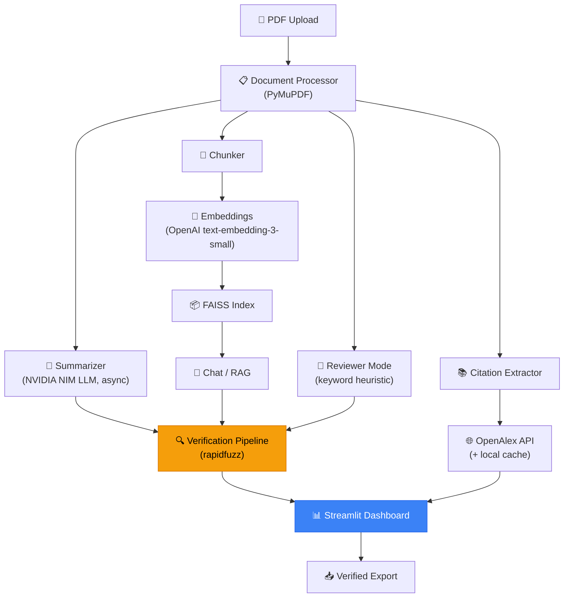

<div align="center">

# 📄 PaperLens
### Evidence-Grounded Research Tutor

**Every AI-generated insight comes with proof — and the proof is checked, not just claimed.**

[](https://www.python.org/)
[](https://streamlit.io/)
[](#-running-tests)
[](#-license)
[](#-known-limitations)
[](https://skill-issue-ayushmaan-aaryan-hckthn.streamlit.app)

### 🔗 [**Try the live demo →**](https://skill-issue-ayushmaan-aaryan-hckthn.streamlit.app)

</div>

---

## 🧠 What is PaperLens?

PaperLens turns a dense academic PDF into an interactive, **evidence-grounded**
research assistant. Upload a paper and it produces a structured summary, a
grounded chat interface, a citation explorer, and a reviewer-style critique —
and then it does the thing most AI paper tools skip: it **programmatically
verifies** that every claim, quote, and page reference it generates is
actually present in the document, instead of trusting the LLM to cite
honestly.

Most AI summarizers hallucinate citations even when explicitly instructed to
quote faithfully. PaperLens' **Evidence Verification Pipeline** fuzzy-matches
every LLM-produced quote against the real, extracted PDF text before it is
ever shown to a user, and badges it accordingly. If the paper doesn't support
an answer, PaperLens says so — it never quietly fills the gap with the
model's training knowledge.

> This project was built as a 5-person hackathon submission. `instructions.txt`
> and `paperlens/integration/CONTRACT.md` capture the original team
> specification and the integration contract each module was built against.

---

## ✨ Core Features

| Feature | Status | Description |
|---|---|---|
| 📤 **PDF Upload & Parsing** | ✅ Live | Text, sections, and page numbers extracted with PyMuPDF |
| 📋 **Structured Summary** | ✅ Live (extractive fallback) | Contributions, Methodology, Results, Limitations, Prerequisites |
| ✅ **Evidence Verification Pipeline** | ✅ Live — *core differentiator* | Every claim fuzzy-matched against real page text and badged ✅ Verified / ⚠️ Paraphrased / ❌ Unsupported |
| 📖 **Synced PDF Viewer** | ✅ Live | Click any claim to jump the PDF to the highlighted supporting text (`streamlit-pdf-viewer`) |
| 💬 **Grounded Chat (RAG)** | ✅ Live (needs `OPENAI_API_KEY`) | FAISS + embeddings retrieval, answers sourced only from the paper, with page citations and confidence scores |
| 🔗 **Citation Explorer** | ✅ Live | References enriched via the OpenAlex API, with local cache fallback and "why was this cited?" explanations |
| 🧑‍⚖️ **Reviewer Mode** | ⚠️ Partial (keyword heuristic) | Currently a keyword-presence scorer (dataset / repo / seed / GPU / p-value mentions), not an LLM review — see [Known Limitations](#-known-limitations) |
| ⚠️ **Consistency Checker** | 🚧 Not implemented | Panel renders but always reports no contradictions found |
| 🌳 **Research Family Tree** | 🚧 Not implemented | Needs the uploaded paper resolved to an OpenAlex ID, which doesn't happen for arbitrary uploads |
| 📥 **Verified Summary Export** | ✅ Live | Exports the summary with verification badges intact |

---

## 🎯 Why "Grounded" Actually Means Something Here

Most tools ask an LLM to "please include page numbers and quotes" and hope
for the best. PaperLens treats that as a claim to be checked, not a fact to
be trusted:

```
LLM generates → claim + candidate quote + claimed page
        ↓
Fuzzy-match the quote against the ACTUAL text on that page (± 1 page)
        ↓
   ≥ 90% match  → ✅ Verified
  60–90% match  → ⚠️ Paraphrased
   < 60% match  → ❌ Unsupported (one fallback search across all pages, then labeled)
        ↓
Badge + match score shown next to every claim, chat answer, and reviewer statement
```

No claim is ever badged Verified while its quote cannot be located — that
invariant is asserted directly in the test suite (`paperlens/tests/`).

---

## 🏗️ Architecture



The app is orchestrated by `paperlens/integration/pipeline.py`, which enforces
one guarantee end-to-end: **nothing reaches the UI without a verification
verdict.** Every module is optional at runtime — `integration/stubs.py`
provides real (non-mocked) local fallbacks for any module that isn't
importable, so the app runs fully offline with no API keys at all, just with
extractive rather than abstractive summarization and lexical rather than
semantic retrieval.

---

## 🛠️ Tech Stack

| Layer | Technology |
|---|---|
| **Language** | Python 3.13 (⚠️ not 3.14 — see [Environment notes](#-environment-notes)) |
| **UI Framework** | [Streamlit](https://streamlit.io/) ≥ 1.59, themed entirely via `paperlens/.streamlit/config.toml` |
| **PDF Viewer** | [`streamlit-pdf-viewer`](https://pypi.org/project/streamlit-pdf-viewer/) ≥ 0.0.30 — pdf.js-based, with `scroll_to_page` and annotation overlays |
| **PDF Parsing & Geometry** | [PyMuPDF](https://pymupdf.readthedocs.io/) (`fitz`) ≥ 1.24 — text/section extraction and quote → bounding-box highlighting |
| **LLM (Summarization)** | NVIDIA NIM (OpenAI-compatible endpoint), also pluggable to any OpenAI-compatible provider via `PAPERLENS_LLM_BASE_URL` |
| **LLM (Chat) / Embeddings** | OpenAI — `gpt-4o` / `gpt-4.1` for chat, `text-embedding-3-small` for embeddings (routable to NVIDIA NIM or another compatible provider) |
| **Vector Store** | [FAISS](https://github.com/facebookresearch/faiss) (`faiss-cpu`, `IndexFlatIP`, cosine similarity via normalized vectors) |
| **Evidence Verification** | [`rapidfuzz`](https://github.com/rapidfuzz/RapidFuzz) — fuzzy string matching + alignment |
| **Citation Metadata** | [OpenAlex API](https://openalex.org/) (free, key optional) with a local JSON cache fallback |
| **Data Validation** | [`pydantic`](https://docs.pydantic.dev/) ≥ 2.0 |
| **Visualization** | Plotly, NetworkX (citation graph currently renders via `st.graphviz_chart`) |
| **Config / Secrets** | `python-dotenv` locally, Streamlit `secrets.toml` on Streamlit Community Cloud |
| **Testing** | `pytest` ≥ 7.0, `pytest-asyncio` ≥ 0.23, plus a standalone 60+-check headless dashboard suite (`dashboard_checks.py`) |
| **Async fan-out** | Python `asyncio` — the summarizer issues per-page calls in parallel; citation lookups are rate-limited/retried |

> **Note:** the repository root also contains a `package.json` /
> `package-lock.json` declaring `animate.css` and a `skills-lock.json` used
> by the [`npx skills`](https://github.com/vercel-labs/skills) CLI to install
> AI-agent skills (see [`AGENTS.md`](AGENTS.md)). Neither is part of the
> runtime application — PaperLens is a pure-Python Streamlit app with **no
> Node.js runtime dependency**; the only custom CSS in the whole app lives in
> `paperlens/ui/splash.py`.

---

## 📂 Project Structure

```
Skill-Issue-Ayushmaan-Aaryan/
├── README.md                      # this file
├── DESIGN.md                      # design-token spec (colors, type) the theme is derived from
├── AGENTS.md                      # guidance for AI coding agents contributing to this repo
├── SHORTCOMINGS.md                # known, verified-by-running-the-app issues (read before demoing)
├── instructions.txt                # original hackathon PRD / team assignment
├── instructions_2.jpeg             # supplementary brief (screenshot)
├── requirements.txt                 # single combined dependency list for the whole app
├── .env.example                    # local environment variable template
├── .gitignore
├── package.json / package-lock.json # unused at runtime — animate.css dep only, not wired up
├── skills-lock.json                 # `npx skills` lockfile for agent skills (see AGENTS.md)
├── samples/
│   ├── sample_paper.pdf             # example input PDF
│   └── sample_output.json           # example of process_pdf() output shape
│
└── paperlens/                       # the application package
    ├── app.py                       # Streamlit entry point: secrets/env → pipeline → dashboard
    ├── README.md                    # dashboard-focused developer notes (Member 5's module)
    ├── .streamlit/
    │   ├── config.toml              # the entire visual theme (native Streamlit theming)
    │   └── secrets.toml.example     # deployed-secrets template for Streamlit Community Cloud
    │
    ├── parser/                      # Document Intelligence (Member 1)
    │   └── document_processor.py    # process_pdf(pdf_path) → {metadata, pages, sections, chunks}
    │
    ├── summarization/               # AI Briefing (Member 2)
    │   ├── briefing.py               # generate_brief(document) — abstractive, LLM-based
    │   ├── prompts.py
    │   └── schemas.py
    │
    ├── rag/                         # Grounded Chat & Retrieval (Member 3)
    │   ├── embeddings.py             # build_index(chunks) — FAISS index over OpenAI embeddings
    │   ├── retriever.py
    │   ├── chat.py                   # ask_question(question, document/index)
    │   └── prompts.py
    │
    ├── verification/                # Evidence Verification Pipeline (shared core, Member 3)
    │   ├── verifier.py               # verify_claim() / verify_claims_batch()
    │   └── fuzzy_match.py
    │
    ├── citations/                   # Citation Intelligence (Member 4)
    │   ├── explorer.py               # explore_citations() → (references, stats)
    │   ├── openalex.py               # OpenAlex API client
    │   ├── extractor.py              # reference-list extraction from parsed text
    │   ├── purpose.py                # "why was this cited?" classification
    │   ├── metrics.py
    │   ├── family_tree.py
    │   ├── cache.py                  # local JSON cache fallback
    │   ├── config.py                 # all citation-subsystem tunables (env-overridable)
    │   └── models.py
    │
    ├── reviewer/                     # Reviewer Mode (stretch goal — currently a stub)
    │
    ├── ai/                            # placeholder package
    │
    ├── ui/                           # Dashboard & UX (Member 5)
    │   ├── home.py                    # landing screen: hero, badge legend, feature catalogue
    │   ├── dashboard.py                # render_dashboard(document, brief, citations) — contract fn
    │   ├── theme.py                    # verification status semantics + tokens Python needs
    │   ├── components.py               # badges, claim cards, tallies, empty/error states
    │   ├── overview.py                 # abstract + visual page index
    │   ├── pdf_pane.py                 # PDF viewer, page nav, highlight overlay
    │   ├── splash.py                   # opening gate animation — the app's only custom CSS
    │   ├── export.py                   # verified-summary export
    │   ├── state.py                    # st.session_state helpers
    │   └── panels/
    │       ├── summary.py
    │       ├── chat.py
    │       ├── citations.py
    │       └── reviewer.py
    │
    ├── integration/                  # Cross-team integration layer
    │   ├── CONTRACT.md                 # ★ what the dashboard consumes — read this first
    │   ├── pipeline.py                 # upload → parsed → verified orchestration
    │   ├── adapters.py                 # import-or-fallback, signature-tolerant dispatch
    │   ├── contracts.py                 # UI dataclasses + tolerant field normalisers
    │   ├── stubs.py                     # real (non-mocked) local fallbacks for missing modules
    │   ├── highlight.py                 # quote → PDF bounding-box geometry
    │   ├── thumbnails.py                # cached page thumbnails
    │   ├── citation_stats.py
    │   ├── textblocks.py
    │   └── fixtures/                    # gitignored demo PDFs (downloaded on demand)
    │
    ├── utils/
    │   └── models.py                    # shared dataclasses (VerifiedClaim, StructuredSummary, …)
    │
    └── tests/
        ├── dashboard_checks.py           # 60+ headless checks against PRD success criteria
        ├── test_cache.py
        ├── test_chat.py
        ├── test_extractor.py
        ├── test_metrics.py
        ├── test_openalex.py
        └── test_retriever.py
```

---

## 🚀 Getting Started

### Prerequisites

- **Python 3.13** (not 3.14 — see [Environment notes](#-environment-notes))
- No API keys are required to run the app. Each key below unlocks one feature; the app is fully functional offline otherwise.

### Installation

```bash
# Clone the repository
git clone https://github.com/skyhawk27/Skill-Issue-Ayushmaan-Aaryan.git
cd Skill-Issue-Ayushmaan-Aaryan

# Create and activate a virtual environment (use python3.13 explicitly if it isn't your default)
python3.13 -m venv .venv
source .venv/bin/activate      # Windows: .venv\Scripts\activate

# Install dependencies
pip install -r requirements.txt
```

### Configuration

```bash
cp .env.example .env
```

| Variable | Unlocks | Notes |
|---|---|---|
| `OPENALEX_API_KEY` | Higher citation-lookup rate limits | OpenAlex works without a key; you'll just see occasional 429s |
| `NVIDIA_API_KEY` | LLM-based (abstractive) summarization | Without it, `summarization/briefing.py` can't even be imported and the app uses an extractive fallback |
| `OPENAI_API_KEY` | Grounded chat + embeddings | Without it, chat offers an explicit opt-in to offline keyword search instead of silently downgrading |
| `OPENAI_MODEL` | Override chat model | Defaults to `gpt-4.1` |
| `PAPERLENS_LLM_BASE_URL` / `PAPERLENS_LLM_API_KEY` / `PAPERLENS_CHAT_MODEL` / `PAPERLENS_EMBEDDING_MODEL` | Route chat + embeddings through any OpenAI-compatible provider (e.g. free-tier NVIDIA NIM) instead of OpenAI | Leave blank to keep default OpenAI behavior |
| `PAPERLENS_RATE_LIMIT_PER_MIN` | Shared request budget across the app | Default `28`, kept under NVIDIA's 40/min |
| `PAPERLENS_MAX_RETRIES` | 429/5xx retry attempts with backoff | Default `6` |

### Run the app

```bash
streamlit run paperlens/app.py
```

Then open the local URL Streamlit prints (typically `http://localhost:8501`).

> **Run this from the repository root**, not from inside `paperlens/`. The
> entry point puts its own directory on `sys.path` so `ui.*` / `integration.*`
> resolve correctly, and `.streamlit/config.toml` next to `app.py` is what
> supplies the theme.

To try the recommended demo paper instead of your own PDF:

```bash
curl -L -o paperlens/integration/fixtures/attention-is-all-you-need.pdf \
  https://arxiv.org/pdf/1706.03762v7
```

---

## 🚀 Deploying to Streamlit Community Cloud

**Live instance:** [skill-issue-ayushmaan-aaryan-hckthn.streamlit.app](https://skill-issue-ayushmaan-aaryan-hckthn.streamlit.app)

The repo deploys as-is; there is nothing to build.

| Setting | Value |
|---|---|
| **Branch** | `main` |
| **Main file path** | `paperlens/app.py` |
| **Python version** | **3.13** (3.14 has no usable PyMuPDF wheel — see below) |

Open **Advanced settings → Secrets** and paste the contents of
`paperlens/.streamlit/secrets.toml.example`, filling in whichever keys you
have. **Keep secrets flat — no `[tables]`.** Streamlit only promotes
*top-level* secrets into `os.environ`, which is how every module reads its
credentials (`os.getenv(...)` at import time); `app.py:_load_secrets()`
forces that promotion to happen before those imports run.

Every key is optional — with none set, upload, structured summary,
verification badges, PDF navigation, evidence highlighting, and export all
still work.

---

## 🧪 Running Tests

```bash
# Team pytest suite (async-aware)
python -m pytest paperlens/tests -q

# Headless dashboard suite — 60+ checks against PRD success criteria
python paperlens/tests/dashboard_checks.py
```

`dashboard_checks.py` is deliberately **not** named `test_*`, since its body
executes on import — letting pytest collect it would run the entire dashboard
during `pytest paperlens/tests`. The `verification/` module has dedicated
coverage for exact matches, paraphrases, fabricated quotes, and page-adjacency
handling, since it's the product's most safety-critical component.

At last check: **178 automated checks passing** (132 dashboard + 46 team pytest).

---

## 🧭 Usage Walkthrough

1. **Upload** a research paper (PDF).
2. Review the **Structured Summary** — every claim carries a ✅/⚠️/❌ verification badge and match score.
3. **Click any claim** to jump the PDF viewer to the highlighted supporting text.
4. Use **Chat** to ask questions about the paper — grounded and verified, with an honest "not enough evidence" response when the paper doesn't cover something.
5. Browse the **Citation Explorer** for enriched references and "why was this cited?" context.
6. Open **Reviewer Mode** for a heuristic reproducibility read (currently keyword-based — see limitations below).
7. **Export** a Verified Summary Card to keep or share.

---

## 👥 Team & Ownership

Originally built by a 5-person hackathon team, each owning one contract function:

| Member | Owns | Key Deliverable | Status |
|---|---|---|---|
| **Member 1** | Document Processing | `process_pdf()` — parsing, chunking, section detection | ✅ Live |
| **Member 2** | AI Briefing | `generate_brief()` — structured, evidence-linked summary | ⚠️ Shipped, but unreachable without `NVIDIA_API_KEY` (module-level client construction) |
| **Member 3** | Research Tutor & Verification | `ask_question()`, `build_index()`, `verify_claim()` | ✅ Live |
| **Member 4** | Citation Intelligence | `explore_citations()` — citation metadata & purpose | ✅ Live |
| **Member 5** | Dashboard & UX | `render_dashboard()` — full UI, PDF viewer, integration | ✅ Live |

The **Evidence Verification Pipeline** (`verify_claim()`) is a shared core
module consumed by Summarization, Chat, and Reviewer Mode alike, and is
treated as never-cut scope. Full field-name/synonym mapping and per-member
integration notes live in
[`paperlens/integration/CONTRACT.md`](paperlens/integration/CONTRACT.md).

---

## 🗺️ MVP Roadmap

| Stage | Adds | Outcome |
|---|---|---|
| **MVP 1 (40%)** | Upload + Summary | Demo Ready |
| **MVP 2 (60%)** | Evidence Grounding + Verification badges | Strong Submission |
| **MVP 3 (80%)** | Verified Chat + PDF highlight + Citation Explorer | Competitive Submission |
| **MVP 4 (100%)** | Reviewer Mode + Consistency Checker + Family Tree + Export | Ideal Final Product |

**Cut order under time pressure:** Family Tree → Verified Summary Export → Consistency Checker → Reviewer Mode. The Verification Pipeline is never cut.

---

## ⚠️ Known Limitations

A fuller, continuously-updated account lives in
[`SHORTCOMINGS.md`](SHORTCOMINGS.md) — written from actually running the app,
not reading the code. Highlights:

- **Reviewer Mode is a keyword scorer**, not an LLM review — it greps for
  terms like "dataset," "github.com," and "p-value" and scores hits ÷ 6. No
  model is involved yet.
- **Consistency Checker always returns empty** — not yet implemented.
- **Research Family Tree does not render** — requires resolving the uploaded
  paper to an OpenAlex ID, which doesn't happen for arbitrary PDFs.
- **Citation metadata can fail entirely for a given paper** if reference
  titles contain commas (OpenAlex uses `,` as its filter separator, and the
  title is interpolated unescaped) — a known, understood, one-line fix.
- **Highlighting can miss ~1 in 6 claims** — this reflects the verification
  pipeline correctly catching non-verbatim (abstractive) quotes, not a bug;
  those claims are correctly badged Paraphrased/Unsupported instead.
- **Citation metadata depends on the OpenAlex API**; a local JSON cache
  fallback keeps the demo resilient to rate limits or outages.
- **Fuzzy-match verification is a heuristic**, not a formal proof system —
  effective at catching hallucinated/mismatched quotes, tuned via
  configurable thresholds (90% / 60%) rather than infallible.

---

## 🔧 Environment Notes

- **Python 3.13, not 3.14.** Every native dependency ships a real `cp313`
  wheel; on 3.14, PyMuPDF 1.28 currently publishes only a free-threaded
  `cp314-cp314t` build plus a less-exercised `cp313-abi3`.
- **Streamlit is pinned `>=1.59`.** Versions 1.41–1.58 have an iframe-scroll
  regression that resets page position and breaks the PDF page-jump feature —
  don't relax this floor.
- **`app.py` must load secrets/env before any teammate module is imported.**
  Several modules read credentials at *import time* (not lazily), so
  `_load_secrets()` / `_load_env()` in `app.py` run first, deliberately.

---

## 🤖 Contributing with AI Coding Agents

This repo ships [`AGENTS.md`](AGENTS.md) and a `skills-lock.json` for
contributors using AI coding agents (e.g. Claude Code) — it points agents at
the project's design skills and at [`DESIGN.md`](DESIGN.md) for the design
system this app's Streamlit theme is derived from. Skills are installed
reproducibly via the [`npx skills`](https://github.com/vercel-labs/skills)
CLI rather than committed to the repo (see `.gitignore`).

---

## 📜 License

This project was built for a hackathon. License terms: MIT (update as appropriate for your submission).

---

<div align="center">

**PaperLens doesn't just summarize research — it teaches it with evidence that's actually verified, not just claimed.**

</div>
